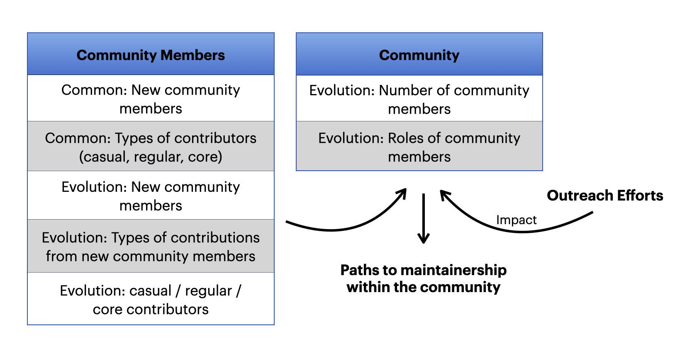

# Conversion Rate

## Why You Should Care 

This metric model provides insights on the roles of contributors within an open source community, helping to
- identify new community members and observe their evolving roles over time 
-	identify casual, regular, and core contributors
-	understand the changing roles of contributors within the community 
-	evaluate if a community is growing or declining
-	evaluate outreach efforts and their influence on the community
-	determine paths to maintainership within the community

## Visual of the Metrics Model

## Metrics in the Metrics Model 
- Common: New community members 
- Common: Types of contributors
- Evolution: New community members
- Evolution: Types of contributions from new community members
- Evolution: casual / regular / core contributors
- Evolution: Number of community members
- Evolution: Roles of community members
