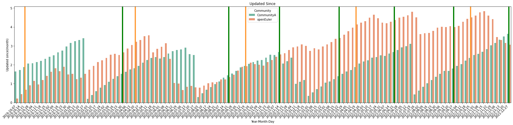
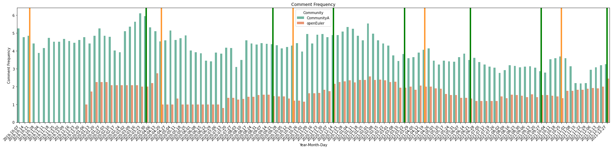
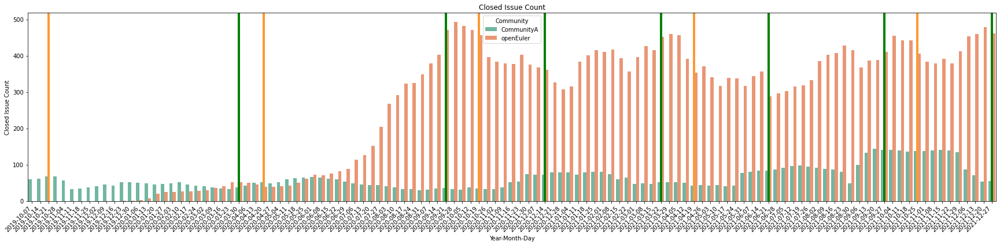
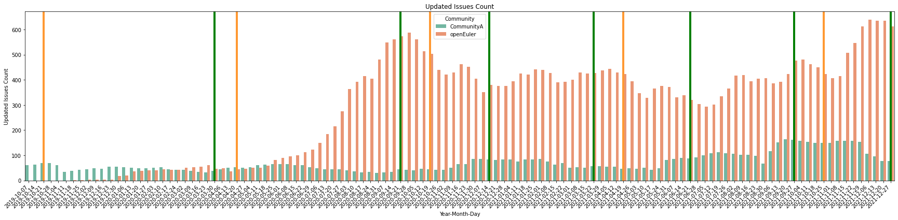

# Community Activity

# Why It Matters
Community Activity is used to describe how active an open source community is.

In order for an open source project to be sustainable, it must continue to be maintained and improved following its initial release. Community Activity describes how much work is being done on a project over time. High levels of community activity may indicate that a project is sustainable and low levels of community activity may indicate that a project is at risk. 

# User Stories
- As a community manager, I want to know how active the projects I manage are.
- As a community manager, I want to investigate increases and decreases of community activity and what  the root cause (good or bad reasons) may be in these changes. 
- As a community manager, I hope there are simple ways that would help me quickly identify how active the projects which I manage.
- As an OSPO or a program manager from a company, I want to collaborate with active communities, which may indicate that bug fixes and feature requirements could be solved efficiently. This is especially important, when I have multiple projects to choose from. 
- As a contributor, I want to join a community which is more active, because I may get more support and the value I create is more visible.

# Metrics in the Metrics Model 
* [Contributors](https://chaoss.community/?p=3467)
    * contributor_count : Determine how many active commit authors, review participants, issue authors, and issue comments participants there are in the past 90 days.
    * maintainer_count : Determine the average number of maintainers per repository.
* [Code Changes Commits](https://chaoss.community/?p=4707)
    * commit_frequency : Determine the average number of commits per week in the past 90 days.
* [Activity Dates and Times](https://chaoss.community/?p=3444)
    * updated_since : Determine the average time per repository since the repository was last updated (in months).
    * created_since : Determine the average time per repository since a repository was created (in months).
    * comment_frequency : Determine the average number of comments per issue in the last 90 days.
    * updated_issues_count : Determine the number of issues updated in the last 90 days.
    * recent_releases_count : Determine the number of releases in the last year
    * meeting_count : Determine the number of meetings held in the last 90 days
    * meeting_attendee_count: Determine the average number of attendees per meeting
* [Contribution Attribution](https://chaoss.community/?p=3616) 
    * org_count : Determine the number of distinct organizations that contributors belong to
* [Change Request Reviews](https://chaoss.community/?p=4712)
    * code_review_count : Determine the average number of review comments per pull request in the last 90 days
* [Issues Closed](https://chaoss.community/?p=3633)
    * closed_issues_count : Determine the number of issues closed in the last 90 day

# Data Insights 

## Background of the Investigated Context
We chose two communities to evaluate the effectiveness of the activity metric model. We anonymized these two communities, so as to not pass judgment on which community is better. In this example, we simply turn results into insights and provide a comparison of two communities to better understand the metric model. 

Both communities are Linux OS distribution communities, including 10,000+ packages, we selected 200 repositories as our sample data source which are core basic packages. Community B has been running for more than 10 years, Community A just created 2 years ago. (Confirmed with Community A, we could publish its name - [openEuler](https://www.openeuler.org/en/))

For the detailed the implementations, you can refer to [community_activity.ipynb](../implementations/linux-distributions/data-insight/community_activity.ipynb)

## Insights Drawn from the Metrics Model
We counted metric model values every week, with vertical lines representing version release dates. We can see that Community B's score is very stable, with an obvious pattern together with version release dates. Community A, as a young community, shows fast growth at the beginning, even exceeding Community B at some points, but there is no obvious pattern. In order to get deeper insights, we needed to check the result of each metric.

 

## Metric Specific Insights Drawn from the Metrics Model

### contributor_count

The number of contributors (engaged these 200 repository contributions) in Community B is very stable,  Community A shows a surge, which means it successfully attracted many new contributors.

### commit_frequency

The result of Commit Frequency shows high relevance with contributor count.  We found that value waves pattern of Community B have the same frequency with metric model overall score. 

### update_since

Project B shows an obvious triangular wave pattern, you would find that almost all the repositories have been maintained before each version was released. However, Project A doesn’t show such capability. 

### comment_frequency

For each single issue, Community A has approximately 5 comments andthe number is very stable. After investigation, we found that each repository in Community A has a stable group of contributors, they always provide support, and the discuss issue-related topics.

### issue handling

We analyzed close_issue_count and update_issue_count together, because they had a strong correlation that was reflected by the figure directly. Higher counts of issue handling indicates high contributor involvement. 

# References

* Rob Pike, [quantifying criticality algorithm](https://github.com/ossf/criticality_score/blob/main/Quantifying_criticality_algorithm.pdf)
* [Analytic Hierarchy Process](https://en.wikipedia.org/wiki/Analytic_hierarchy_process)

# Contributors 
* Yehui Wang
* Jun Zhong
* Chenqi Shan
* Matt Germonprez
* Kevin Lumbard
* Vinod Ahuja
